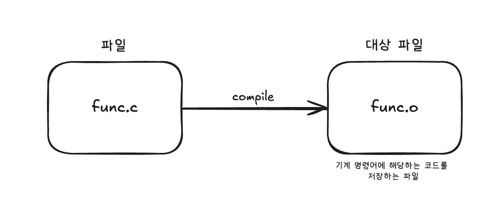
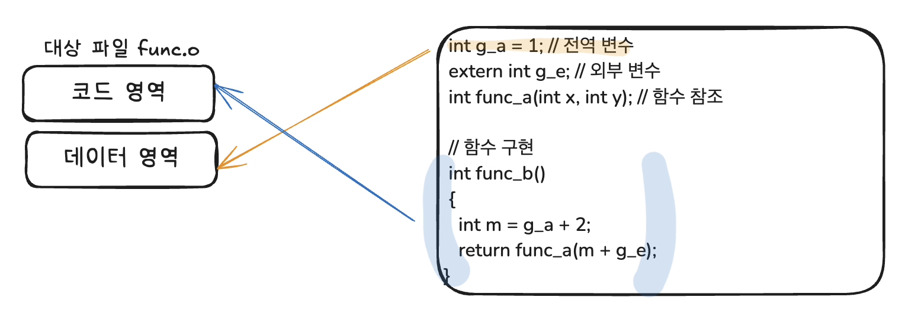
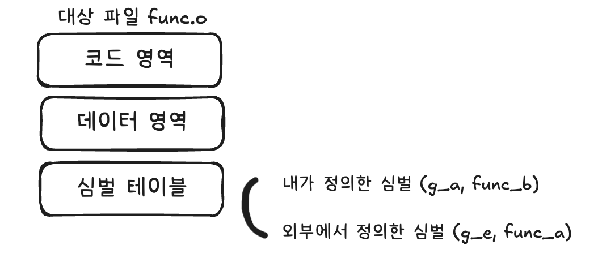
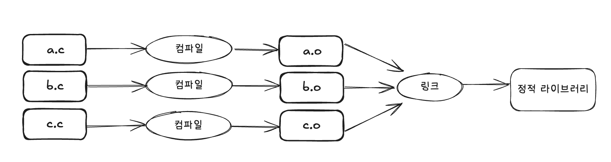
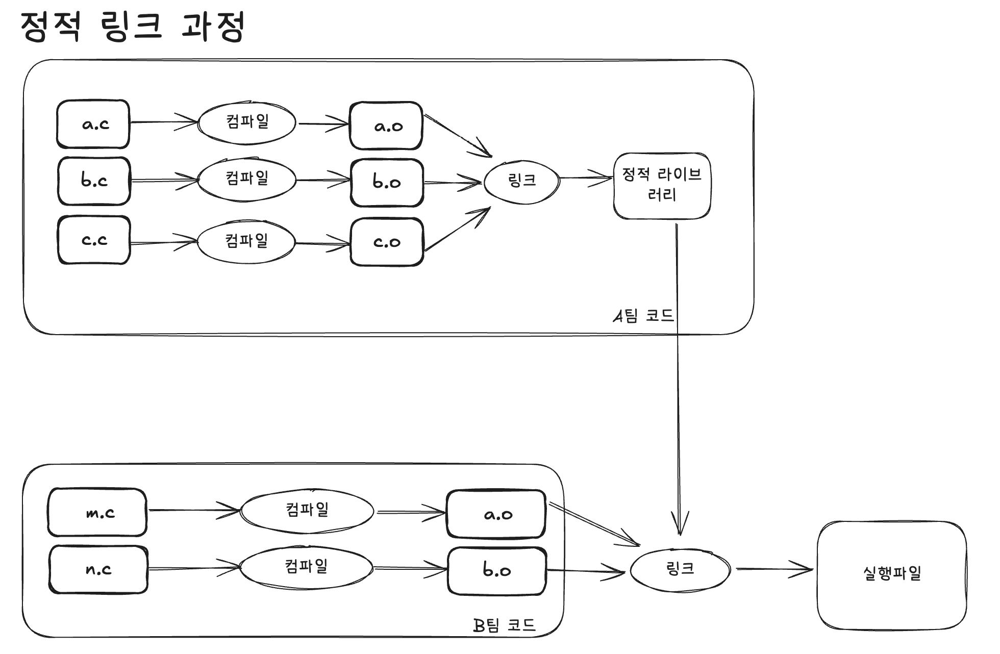
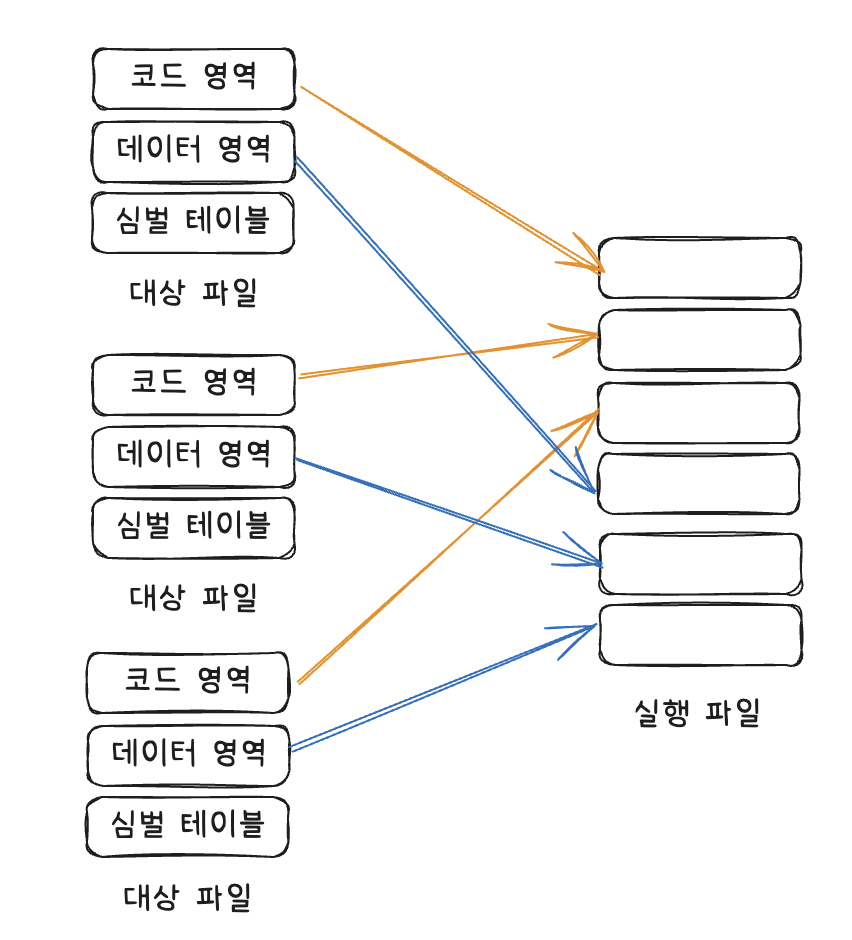
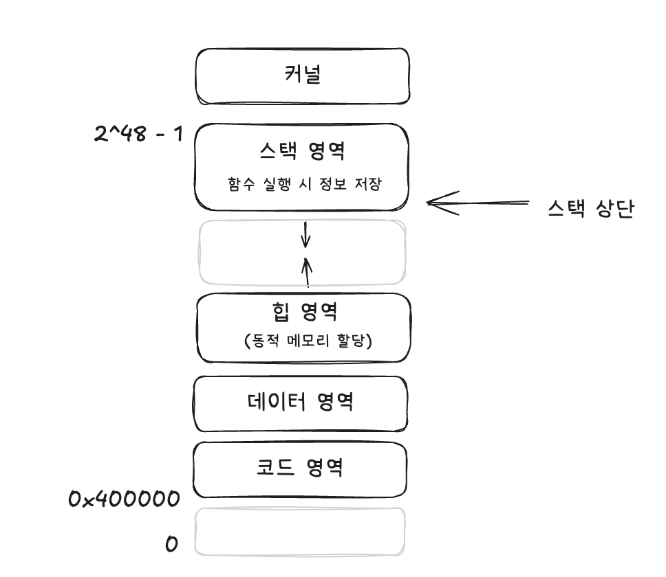
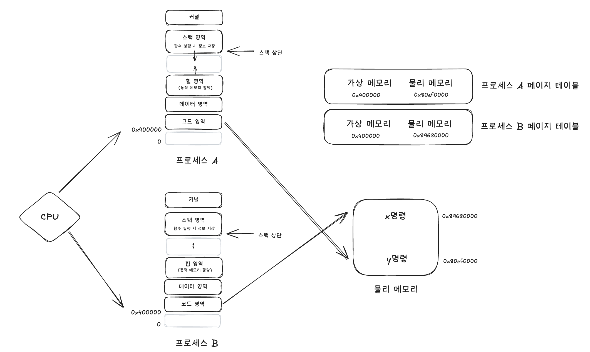

## 1.3 링커의 말할 수 없는 비밀

### 1.3.1 링커는 이렇게 일한다.



링커는 **컴파일러가 생성한 대상 파일(.o)** 여러개를 하나로 묶어 하나의 **최종 실행파일**을 생성한다.


링크의 전체 과정은 저자 여러 명이 챕터 별로 따로 집필하고, 개별 챕터를 묶어 책 한 권으로 출판하는 것과 비슷하다.

1. 우리가 작성한 프로그램이 다른 모듈의 API, 또는 변수를 참조할 때, 각 모듈 간 종속성이 올바르게 설정되어있는지 확인한다.

   - 링커가 하는 역할은 **종속성이 올바르게 설정**되어 있는지, 즉 인터페이스 구현이 종속된 모듈에서 사용 가능한지 확인한다.

   - 링크 과정에서, 우리가 참조하고 있는 외부 심벌에 대한 실제 구현을 찾아내서 연결하는 작업을 하는데, 이를 **심벌 해석**이라고 한다.

2. 링크 과정이 끝나면 최종적으로 **실행 파일이 생성**된다.

3. 링크 과정에서 링커는 **재배치**를 진행한다.
   - 특정 소스 파일에서 다른 모듈의 함수를 참조할 때, 컴파일러는 해당 함수의 메모리 주소를 N으로 표시하고 넘어간다. 
   - 링크 과정에서 링커가 이러한 표시들을 확인하고 한데 모아 실행 파일을 생성하는 과정에서 함수의 정확한 주소를 확인하고 N을 실제 메모리 주소로 대체한다. (= 재배치)


### 1.3.2 심벌 해석: 수요와 공급

**심벌이란**? 전역 변수와 함수의 이름을 포함한 **모든 변수의 이름** (지역 변수는 외부 모듈에서 참조할 수 없기 때문에 관심 대상이 아님)


링커는 해당 단계에서 대상 파일에서 참조하는 외부 심벌마다 **대상 정의가 반드시 존재**하는지, **단 하나만 존재**하는지 확인.

```c
int g_a = 1; // 전역 변수
extern int g_e; // 외부 변수
int func_a(int x, int y); // 함수 참조

// 함수 구현
int func_b()
{
  int m = g_a + 2;
  return func_a(m + g_e);
}
```


링커의 관심사 

- 소스 파일에 다른 모듈에서 참조할 수 있는 심벌 두 개(g_a, func_b)
- 소스 파일이 다른 모듈에서 정의한 심벌 두 개를 참조 (g_e, func_a)


이러한 정보는 컴파일러가 링커에게 알려 준다.

컴파일러는 기계 명령어 생성뿐만 아니라, 이 명령어를 실행시키는 데이터 생성하는데, 이 데이터는 대상 파일에 반드시 포함된다.

- `명령어 부분` (= 코드 영역) : 소스 파일에 정의된 함수에서 변환된 기계 명령어가 저장되는 부분
- `데이터 부분` (= 데이터 영역) : 소스 파일의 전역 변수가 저장되는 부분





컴파일러는 컴파일 과정에서 소스 파일마다 1) 외부에서 참조 가능한 심벌이 어떤 것인지 정보를 기록하고, 2) 어떤 외부 심벌을 참조하는지 **심벌 테이블에 기록**하고 대상 파일에 심벌 테이블을 저장한다.




링커는 각 대상 파일에서 사용할 외부 심벌이 심벌 테이블에서 유일한 정의를 발견 가능한지 확인하는 **심벌 해석 과정**을 거친다. 

```c
void func();

void main()
{
   func();
}
```

```shell
# gcc main.c
/tmp/ccPPrzVx.o: In function 'main':
main.c(.text+0xa): undefined reference to 'func' // 컴파일 오류는 발생하지 않았지만 링커가 func 함수에 대한 정의를 찾지 못함
...
```


### 1.3.3 정적 라이브러리, 동적 라이브러리, 실행 파일

정적 라이브러리

- 구현된 모든 함수의 선언을 포함하는 헤더파일을 제공

- 소스 파일 여러 개를 미리 개별적으로 컴파일하고 링크하여 정적 라이브러리로 생성
- 소스파일마다 단독으로 컴파일



이후 실행파일을 생성할 때에는 자신의 코드만 컴파일하며, 미리 컴파일이 완료된 정적라이브러리는 다시 컴파일 할 필요 없이 링크 과정에서 그대로 실행 파일에 복제한다.





정적 링크는 대상 파일을 한데 모아 각각의 대상 파일에서 데이터 영역과 코드 영역을 각각 결합하는 것.

이 때, 실행 파일에도 코드 영역과 데이터 영역이 있어 대상파일과 매우 흡사해보이지만 실행파일에는 특수 심벌 `_start`가 있어 심벌 주소에서 프로그램을 실행하는데 필요한 기계 명령어를 찾는다. 이 기계 명령어를 실행한 이후 main 함수를 실행한다.



정적 링크 단점

- 라이브러리를 실행파일에 직접 복사하기 때문에 표준 라이브러리를 사용한다면, 정적 링크로 생성된 실행 파일은 모두 동일한 코드와 데이터 복사본을 갖는다.

- 즉, 디스크 공간과 메모리를 낭비할 수 있다.
- 또한, 정적 라이브러리 코드가 변경될 때마다 매번 해당 정적 라이브러리가 종속된 프로그램을 다시 컴파일한다.


이 문제는 동적 라이브러리(= 공유 라이브러리, 동적 링크 라이브러리) 를 통해서 해결할 수 있다.윈도우에선 DLL 파일, 리눅스에서는 `libxxx.so` 확장자 파일(lib는 접두사)

```shell
$ gcc -shared -fPIC -o libfoo.so a.c b.c // 두 소스파일 a.c 와 b.c가 있을 때, 동적 라이브러리 foo로 생성
```


동적 라이브러리는 정적 라이브러리와 동일하게 코드 영역, 데이터 영역 등이 포함되어있다. 단지 동적 라이브러리의 사용 방식과 사용 시간이 정적 라이브러리와 다를 뿐이다. 

|                | 정적 라이브러리                                  | 동적 라이브러리                                              |
| -------------- | ------------------------------------------------ | ------------------------------------------------------------ |
| 실행 파일 내용 | 코드 영역과 데이터 영역을 각 실행파일에 **복사** | 참조된 동적 라이브러리 이름, 심벌 테이블, 재배치 정보 등<br /> **필수정보만 실행파일에 포함** |


동적 라이브러리에 포함된 필수 정보는 동적 링크가 일어나는 시점에 사용된다.


#### 동적 링크의 두가지 방식

1) 프로그램이 메모리에 적재 될 때 동적 링크 진행

   - 적재는 실행 파일을 실행시키기 위해 디스크에서 읽어 메모리의 특정 영역으로 이동시키는 과정. 이 과정에서 적재 도구 `loader`라는 전용 프로세스가 실행됨.

   - 실행 파일을 적재하고 나면, **로더는 실행 파일이 동적 라이브러리에 의존하는지 확인** 가능

   - 동적 라이브러리가 필요하다면, **동적 링커**라는 별도의 프로세스가 실행되어 **참조하는** **동적 라이브러리 존재 여부, 위치, 심벌의 메모리 위치 등을 확인하여 링크 과정을 마무리** 함.

   - 만약 동적 링크 과정에서 문제가 발생하면 종속된 동적 라이브러리를 발견하지 못했다는 오류 메시지를 표시하고 실행이 종료됨.

   - 이렇게 적재 중 동적 링크를 사용하려면 실행 파일이 어떤 동적 라이브러리를 참조하는지 컴파일러에 명시적으로 알려주어야 함. 

     ```shell
     $ gcc -o pro main.c /path/to/libfoo.so 
     // libfoo 라이브러리에 의존하는 main.c 파일을 컴파일하여 pro 실행파일 생성. 컴파일과 링크 과정이 모두 포함되어 잉씀.
     // Shared Object (공유 객체, 동적 라이브러리) 즉, libxxx.so는 동적으로 로딩되는 라이브러리 파일을 의미
     ```

2. 프로그램이 먼저 실행된 후, 프로그램의 실행시간(runtime)동안 코드가 직접 동적 링크를 실행할 수 있음.
   - 런타임 : cpu가 프로그램을 실행하기 시작한 시점부터 실행이 완료되어 프로그램이 종료된 시점까지의 시간
   - 실행 파일을 생성하는 과정에서 실행파일 내부에 동적 라이브러리 정보가 저장되지 않는 대신, 프로그래머가 코드에 특정 API를 사용하여 필요할 때마다 동적 라이브러리를 직접 동적으로 적재할 수 있음. (리눅스에서는 `dlopen`, `dlsym`, `dlclose` 등의 함수로 런타임 동적 링크를 사용할 수 있음. `ldl` 옵션을 추가해야 함 )


### 1.3.4 동적 라이브러리의 장단점

#### 장점

- 모든 프로세스가 하나의 코드를 공유하기 때문에 메모리 적재와 디스크 저장에 필요한 **리소스를 대폭 절약**할 수 있음 (공유 라이브러리라고 불리는 이유)

- 동적 라이브러리의 코드가 **수정되면 해당 동적 라이브러리만 다시 컴파일**하면 됨 => 버그 수정과 프로그램 업그레이드에 용이

- 플러그인으로 **프로그램 기능을 쉽게 확장**할 수 있음.

  - 미리 사전에 함수 여러개를 정의해두고 플러그인에서 해당 함수들을 구현. 플러그인을 적재하여 프로그램이 사용하도록 하여 프로그램의 기능들을 확장하는데에 용이하게 함.

- 여러 언어를 **혼합하여 개발**할 때 유용함.

  - C, C++같이 높은 성능이 요구되는 부분을 작성하여 동적 라이브러리를 생성, 나머지 부분은 파이썬 같은 다른 코드로 작성하여 여러 언어를 혼합하여 개발하고 재사용 효율을 높일 수 있음.

    

#### 단점

- 프로그램이 적재되는 시간 또는 실행 시간에 링크되기 때문에 정적 링크를 사용할 때보다 **성능이 떨어짐.** 
- 특정 메모리 주소와 독립적으로 동작하기 때문에 **위치 독립 코드**라고 불림.
  - 메모리에 단 하나의 복사본만 존재하고, 해당 코드는 여러 프로세스가 공유하기 때문에 절대 주소로 참조하기 어려움.

- 종속된 동적 라이브러리를 제공하지 않거나 그 버전이 **호환되지 않을 경우 프로그램 실행이 되지 않음.**

> 혁진: jvm은 정적 라이브러리, 동적 라이브러리? 
>
> 혁진: 자바는 BootJar하면 라이브러리가 다 포함되서 빌드되지만, 동적 로딩 이점을 살리기 위해 동적 로드(링킹)을 사용한다고 함
> C처럼 OS에서 링킹하진 않기 때문에 동적 라이브러리를 동적 로드 한다는 말보다는 JVM이 동적 로드한다는 말이 더 올바른 표현.
>
> 종민: gradle 과정에서 `compileOnly`라는 옵션을 줄 수 있음.
> (compileOnly : 애플리케이션을 작성하고 컴파일 시점까지만 해당 의존성 사용하겠다는 의미 / 참고 : https://jongmin92.github.io/2019/12/05/Java/nosuchmethod/ )
>
> 종민: jvm은 기본적으로 자주 사용하는 코드를 hotspot이 최적화해줌 (hotspot jvm)
> 저번에 얘기한 `graalvm`은 실행할 때 빠르고, `hotspot jvm`은 실행시점에 느리지만, 실행할수록 hotspot에 의해 최적화된다.
> graalvm은 실행시점에 이미 기계어로 번역되어있기 때문에 리플렉션을 못씀.


### 1.3.5 재배치: 심벌의 실행시 주소 결정하기

컴파일러는 컴파일을 통해 대상파일을 생성할 때 foo 함수가 어느 메모리 주소에 적재될지 알수 없기 때문에 간단히 0x00으로 지정하여 호출한다고 기록만한다. (시작주소 기준 오프셋이 60바이트라고 가정)

이 때, `.relo.text`에 해당 명령어를 저장하고, `.relo.data`에 해당 명령어와 관련된 데이터를 저장한다.


링커는 심벌 해석을 통해 각 유형의 영역끼리 모두 결합한다. (코드 영역끼리, 데이터 영역끼리...) 따라서 메모리 주소를 결정할 수 있기 때문에 foo 함수의 런타임 메모리주소를 알 수 있다.

링커는 각 대상파일의 `.relo.text` 영역을 하나씩 읽어 기계 명령어를 수정해야하는 foo라는 심벌이 있으며, 이 심벌의 코드 영역 시작 주소 기준 오프셋이 60바이트라는 것을 확인하고, 이렇게 확인한 정보를 이용하여 call 명령어를 찾고 해당 주소를 런타임 메모리주소로 수정한다.


링커가 프로그램이 실행된 후 변수나 기계 명령어 메모리 주소를 확인할 수 있는 이유가 무엇일까? 변수나 메모리 주소는 프로그램이 실행될 때마다 변경되기 때문에 실제로 그 시점이 되어야 알 수 있지 않을까? 링커가 런타임 메모리주소를 미리 알 수 있는 방법은 무엇일까?


### 1.3.6 가상 메모리와 프로그램 메모리구조



프로그램이 실행되면 해당 프로그램의 프로세스가 메모리에 적재된다. (위 그림은 이 프로세스가 어떤 형태로 메모리에 적재되는지를 보여주는 그림)

- 스택 영역 (메모리 상위)
- 빈 공간
- 힙 영역 (malloc함수가 이 힙 영역에서 메모리를 할당받는다)
- 데이터 영역 (실행 파일의 내용)
- 코드 영역 (실행 파일의 내용)

모든 프로그램의 코드 영역은 0x400000부터 시작한다. 만약 두 프로그램이 동시에 실행중이라면, CPU가 A프로그램을 실행할 때 가져온 명령어는 프로그램 A의 메모리 주소에 속하고, B 프로그램을 실행할 때 가져온 명령어는 B 프로그램의 메모리 주소에 속한다.


가상 메모리는 프로그램이 각각 실행중일 때, **자신이 모든 메모리를 독점**하고 있다고 생각한다. (따라서 위 그림은 논리적으로 존재하는 허상임)

모든 프로그램이 위 그림과 같은 표준적인 메모리 구조를 가질 수 있는 이유이다. 또한, 링커가 실행파일을 생성하자마자 실행 시 심벌 메모리 주소를 결정할 수 있는 것도 프로세스 메모리 구조를 알고 있기 때문이다. 

링커는 실질적인 물리 메모리 주소는 전혀 신경쓰지 않기 때문에 링커 설계가 크게 간소화될 수 있다.


#### 물리 메모리 주소

실행 파일의 코드 영역이 물리 메모리 주소 `0x80ef0000`에 적재된다고 가정하면 시스템에는 다음과 같은 매핑 정보가 추가되며, 이러한 표를 **페이지 테이블**이라고 한다.

(실제 운영체제의 모든 메모리 주소에 대해 이런 매핑 관계를 유지하는 것은 아니며, 메모리 페이지 단위로 관리된다.)

| 가상 메모리 | 물리 메모리 |
| ----------- | ----------- |
| 0x400000    | 0x80ef0000  |

각각의 프로세스는 자신만의 페이지테이블이 있으며, CPU가 프로그램 A를 실행하고 메모리 주소 `0x400000`에 접근하면, 특별히 설계된 하드웨어가 페이지 테이블을 참조하여 물리메모리주소 `0x80ef0000` 으로 변환한 후 접근한다.

> 특별히 설계된 하드웨어? **TLB (Translation Lookaside Buffer)**
> 가상 주소를 물리 주소로 변환할 때 자주 사용하는 페이지 테이블 항목을 캐시하는 하드웨어. 
> 메모리 접근 시 페이지 테이블을 매번 검색하는 대신, TLB에서 변환 정보를 빠르게 가져오는 방식으로 성능을 크게 향상시킬 수 있다.
> CPU에 내장된 하드웨어로, 가상 메모리 시스템에서 매우 중요한 역할을 함.




- 모든 가상 메모리는 표준화 되어 있고 크기가 동일
- 프로세스마다 각 영역의 크기가 다를 수는 있지만, 영역이 배치되는 순서는 동일하다.
- 실제 물리 메모리 크기는 가상 메모리 크기와는 무관하며, 물리 메모리에는 힙, 스택 등 영역 구분조차 하지 않는다. (운영체제마다 조금씩 다를 수 있음)
- 모든 프로세스는 자신만의 페이지 테이블을 가지고 있으며, 같은 가상 메모리 주소라도 페이지테이블을 확인하여 서로 다른 물리 메모리 주소를 획득한다. 이런 이유로 CPU는 동일한 가상 메모리 주소에서 서로 다른 내용을 가져올 수 있다.


