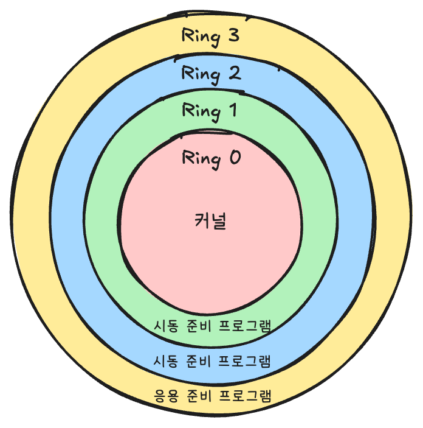
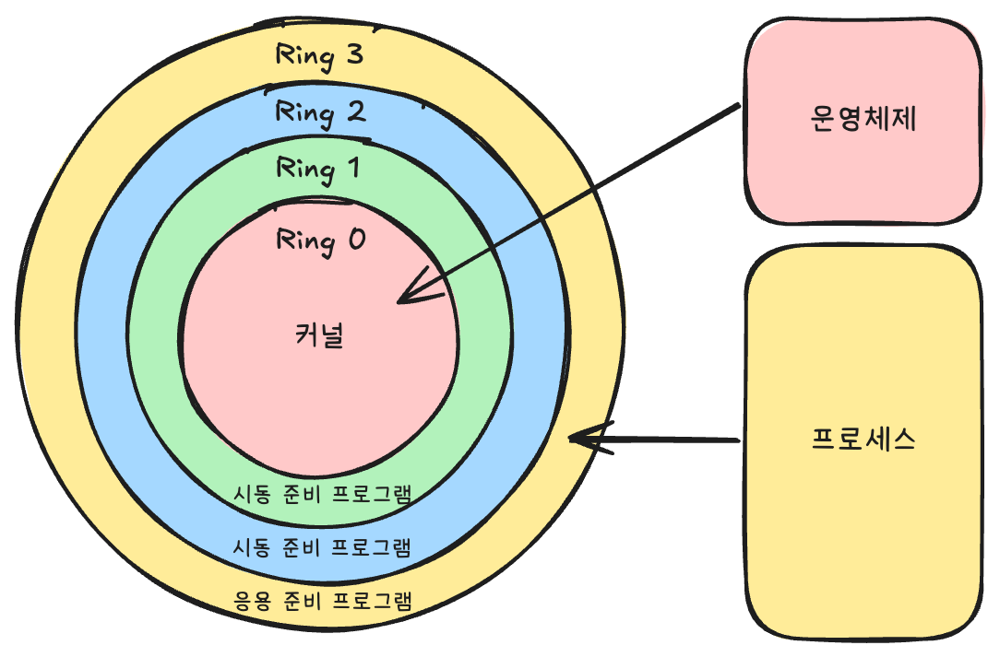
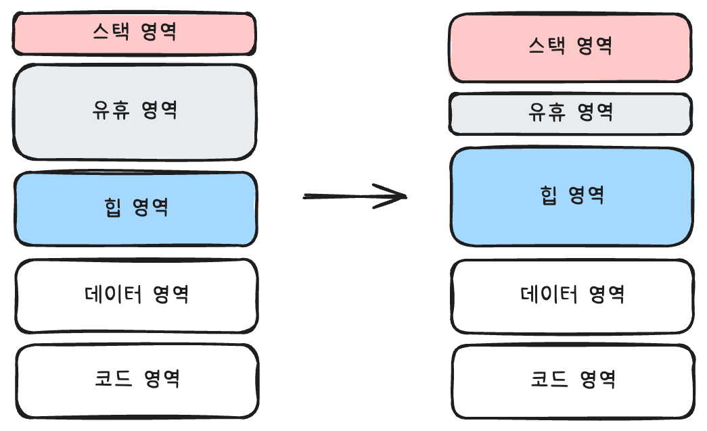

## 3.5 메모리 할당 시 저수준 계층에서 일어나는 일

### 3.5.1 CPU 실행 상태



- **네 가지 특권 단계(privilege level)**

  - x86 CPU 기준 코드는 위와 같이 네 가지 특권 단계로 나뉨
  - 0, 1, 2, 3은 CPU의 여러 동작 상태를 나타냄

  - <u>작을수록 CPU 특권(privilege)은 커짐</u>

- **특권**

  - 일부 명령어를 <u>CPU가 실행</u>할 수 있는지 나타냄
  - 일부 기계 명령어는 CPU가 가장 높은 특권 단계(0단계)일 때 실행 가능함

- 일반적으로 CPU는 0, 3단계만 사용함

  - **0단계 특권 :** 사용자 상태(user mode)
  - **3단계 특권 :** 커널 상태(kernel mode)


### 3.5.2 커널 상태와 사용자 상태



- **커널 상태(kernel mode)**
  - CPU가 <u>운영체제 코드를 실행</u>할 때의 상태
  - 모든 기계 명령어 실행 가능
  - 모든 주소 공간 접근 가능
  - 모든 하드웨어 제한 없이 접근 가능
- **사용자 상태(user mode)**
  - CPU가 <u>운영체제 이외의 코드(helloworld 같은 프로그램) 실행</u>할 때의 상태
  - 여러 곳에서 제한 받음
    - 특정 주소 공간 접근 불가
  - 운영체제를 죽이지 못하게 함 
    - 죽일 경우 segmentation fault 발생

> **Segmentation Fault(Segfault)**
>
> - 프로그램이 접근 권한이 없는 메모리 영역을 읽거나 쓸 때 발생하는 오류
> - 예를 들어, 잘못된 포인터 참조나 NULL 포인터 접근 시 발생할 수 있음
> - 운영체제는 이를 감지하고 해당 프로세스를 강제 종료함, 그래서 프로그램이 죽음


### 3.5.3 시스템 호출

- CPU는 다음 제약 조건이 있음
  - 커널 상태에서 응용 프로그램 호출 못함
  - 사용자 상태에서 운영 체제 코드 호출 못함
  - <u>호출이 필요한 경우?</u>
- **시스템 호출(system call)**로 운영 체제 코드 호출 가능함
  - 응용 프로그램에서 파일 읽기, 쓰기나 네트워크 데이터 송수신 등의 운영체제를 호출할 수 있음

- 일반적으로 파일, 네트워크 I/O 기능은 별도 **표준 라이브러리 API**를 사용하기 때문에 시스템 호출을 직접 할 일 없음
  - <u>왜 그럴까?</u>


### 3.5.4 표준 라이브러리

- **시스템 호출 표준화**
  - 리눅스, 윈도우 운영 체제마다 <u>시스템 호출 형태가 다름</u>
  - 즉 <u>호환이 안됨</u>
- **표준 라이브러리(standard library)**
  - **형태 :** 응용 프로그램 ➡️ 표준 라이브러리 ➡️ 운영 체제 ➡️ 하드웨어
  - 표준 라이브러리 코드는 사용자 상태에서도 실행됨
  - 표준 라이브러리는 <u>운영 체제에 따라</u> 대응 되는 시스템 호출을 선택함
- **메모리 할당과 관련성?**
  - malloc 같은 메모리 할당자도 운영 체제 일부가 아닌 <u>표준 라이브러리 일부로 구현</u>
  - <u>왜 시스템 호출을 얘기하지?</u>


### 3.5.5 힙 영역의 메모리가 부족할 때



- **여유 메모리 조각이 부족해지면?**
  - 힙 영역과 스택 영역 사이 여유 공간이 있음
  - <u>스택 영역의 콜 스택이 깊어질수록</u> 아래쪽으로 메모리 점유가 늘어남
  - <u>힙 영역의 메모리가 부족</u>하면 위쪽으로 메모리 점유가 늘어남

- **힙 영역을 늘리려면?**
  - malloc이 운영 체제에 메모리 요청함
  - 힙 영역 최상단을 가리키는 <u>brk(break) 변수를 위로 이동</u>시키는 행동임
  - 이를 위해선 <u>시스템 콜이 필요</u>함


### 3.5.6 운영 체제에 메모리 요청하기

- **메모리가 부족한 경우**
  1. **사용자 상태 :** 응용 프로그램은 malloc을 호출하여 메모리 할당 요청
  2. **사용자 상태 :** malloc은 여유 메모리 조각 검색 후 있으면 이를 할당 
  3. **커널 상태 :** 여유 메모리 조각이 없으면 brk 시스템 호출을 통해 힙 영역 확장을 요청
  4. **사용자 상태 :** 힙 영역 늘어나면 malloc이 여유 메모리 조각 찾아 할당

> 단순 메모리 할당에도 운영 체제 도움이 필요하다. 즉 시스템 호출 필요하다.


### 3.5.7 할당 된 메모리의 형태

- malloc 호출해서 받은 메모리는 **가상 메모리**임
- 실제 <u>물리 메모리에 할당되지 않았을 수 있다</u>는 것임
- 할당한 메모리가 <u>사용되는 순간에 물리 메모리를 할당</u>함
  - 운영 체제 내부에서는 가상 메모리가 아직 실제 물리 메모리와 연결되지 않았다면 페이지 누락 오류(page fault)를 감지하여 페이지 테이블 수정 후 가상 메모리와 실제 물리 메모리를 매핑함
- malloc이 <u>할당 받는 행위는 가상 메모리에 불과하며 사용자 상태에서 처리</u>됨


### 3.5.8 메모리 할당의 무거움

- 메모리 할당 한 줄은 다음의 복잡한 과정을 거치며 시스템 성능(느리고, 단편화 Fragmentation 발생)에 영향을 미침
  1. malloc이 여유 메모리 조각 검색 후 있다면 할당
  2. 없다면 시스템 호출(brk)로 힙 영역 확장 요청하여 여유 메모리 얻음
  3. 이 때 <u>커널 상태가 되는데 운영 체제가 가상 메모리 시스템이 힙 영역을 확장하는 작업을 시작</u>함
  4. 시스템 호출이 종료되면 malloc으로 제어권이 돌아가며 사용자 상태로 전환 됨
  5. 응용 프로그램은 메모리 할당 요청을 종료하고 다음 코드를 실행함
  6. 코드가 요청된 메모리 사용할 때, <u>커널 상태로 전환되며 실제 물리 메모리를 할당</u>(메모리 매핑)함
  7. 사용자 상태로 돌아가 다음 코드 실행함

- 시스템 성능 영향을 줄이기 위해 malloc 대신 <u>메모리 풀(memory pool) 기술</u>을 사용함


## 3.6 고성능 서버의 메모리 풀

- malloc 대신 시스템 성능 향상을 위 메모리 풀 기술을 사용할 수 있음


### 3.6.1 메모리 풀 vs 메모리 할당자

- 메모리 할당자(malloc)
  - 표준 라이브러리 계층
  - 비교적 복잡함
  - 범용 사용 가능함
- 메모리 풀
  - 응용 프로그램 계층
  - 간단함
  - 범용성이 떨어짐


### 3.6.2 메모리 풀 원리

- 한 번에 큰 메모리 조각을 요청하고 <u>자체적으로 메모리 할당과 해제를 관리</u>

  - <u>표준 라이브러리와 운영 체제 우회</u>

- 예 : 사용자 요청 치리 때마다 여러 객체 생성해야할 때 자체 메모리 풀에 미리 생성해두고 재사용

  

### 3.6.3 초간단 메모리풀 구현

- 간단 버전 : 한 종류의 객체
  - 미리 만들어놓고 할당, 반환하며 재사용하면 됨
- 약간 복잡 버전 : 여러 크기 객체
  - 요청 처리 시 메모리 요청만 하고 해제는 하지 않음
  - 사용자 요청 처리 완료 시 모든 메모리 한번에 해제
  - 해제 때마다 힙 영역의 메모리 병합, 분할(Fragmentation 해결) 할 필요 없어짐


### 3.6.4 복잡한 메모리풀 구현

- 여러 크기 메모리 할당을 위해 여유 메모리 조각을 관리함
- 모든 메모리 조각을 연결 리스트로 연결 후 포인터를 사용해 여유 메모리 조각 위치 기록
- 여유 메모리 할당 요청 시엔 포인터로 쉽게 찾을 수 있음
- 해제 기능은 여전히 제공하지 않고 한번에 메모리 풀 해제

> 메모리 블록의 풀을 관리할 일이 있는가?


### 3.6.5 메모리 풀의 스레드 안전 문제

- 메모리 풀을 여러 스레드에서 공유하기 위해 락을 사용하면 잠금 경쟁이 심해짐
- 각 스레드 전용 저장소(thread local)에 메모리 풀을 넣어 사용하면 됨

>  지만 A 스레드에서 사용하던 메모리를 B 스레드에서 해제해야하는 경우는? 이거 자체가 이해가 잘 안 감. 스레드 로컬은 스레드 완료 시 해제되는것 아닌가?


## 3.7 메모리 관련 버그

### 3.7.1 지역 변수 포인터 반환

```c
int* func() {
    int a = 2;  // 지역 변수 'a' 선언 및 값 2 할당
    return &a;  // 'a'의 주소 반환 (문제 발생!)
}

void main() {
    int* p = func();  // 'func()'에서 반환된 주소를 p에 저장
    *p = 20;  // 해당 주소에 20을 할당 (문제 발생!)
}
```

- 이 코드에서 `func()`는 지역 변수 `a`의 <u>주소를 반환</u>하고 있음
- 하지만 <u>지역 변수는 함수가 종료되면 스택 프레임에서 제거</u>됨
- `p`가 가리키는 메모리(포인터)는 이미 없는 변수를 가리키므로 <u>유효하지 않은 상태</u>가 됨
- 이후 다른 함수가 호출되며 스택 프레임을 덮어쓰며 p의 내용을 덮어쓰거나 p가 수정되며 다른 함수의 스택 프레임이 파괴될 수 있음


### 3.7.2 포인터 연산의 잘못된 이해

```c
int sum(int* arr, int len) {
  int sum = 0;  // 합계를 저장할 변수
  
  for (int i = 0; i < len; i++) {
    sum += *arr;    // 현재 arr가 가리키는 값을 더함
    arr += sizeof(int);  // 문제 발생! 포인터 증가 방식 오류
  }
  
  return sum;
}
```

- arr 배열이 가리키는 값을 sum에 더하고 int 만큼 포인터를 옮기려는 것임, 즉 <u>배열의 합 계산 코드</u>
- 하지만 포인터 연산에서 1을 더하는 것은 1바이트 만큼 이동하는 것이 아닌 <u>단위 한 개 만큼 이동</u>
- 즉 1을 더하면 알아서 포인트가 가리키는 구조체가 int인 4바이트이므로 1을 더하면 4바이트 만큼 이동함
- 예를 들어, `sizeof(int) == 4`인 환경에서는 `arr += 4;`을 하면 `arr`이 <u>16바이트(4칸)씩 증가</u>하게 됨!


### 3.7.3 문제 있는 포인트 역참조

```c
int a;

scanf("%d", a); // -> &a
```

- scanf는 사용자가 입력한 값을 변수에 저장하기 위해 변수의 메모리 주소가 필요함

- 즉 엉뚱한 주소에 값을 저장해서 문제가 발생할 수 있음

  - 코드 영역 또는 기타 읽기 전용 영역 : 프로세스 강제 종료 시킴
  - 스택 영역 : 다른 함수 스택 프레임 파괴
  - 힙 영역이나 데이터 영역 : 프로그램이 동적으로 할당한 메모리 파괴

  

### 3.7.4 초기화되지 않은 메모리 읽기

```c
void add() {
  int *a = (int*)malloc(sizeof(int));
  
  *a += 10;
}
```

- 이 코드는 `malloc()`을 사용하여 힙(Heap)에 `int` 크기만큼의 메모리를 할당하고, 그 후 할당된 메모리에 `10`을 더하려는 의도를 가진 코드
- 하지만 다음 가능성 존재
  - malloc이 반환한 메모리 조각에 이전 사용 정보 남아 있을 수 있음, 즉 0이 아닐 수 있음
  - malloc이 메모리 못 찾으면 brk 시스템 콜로 메모리 요청하여 물리 메모리 할당하며 보안적 목적으로 0으로 초기화 될 수 있음


### 3.7.5 이미 해제된 메모리 참조

```c
void add() {
  int* a = (int*)malloc(sizeof(int));
  ...
  free(a);
  
  int b = *a;
}
```

- 힙 영역에 메모리 조각 요청 후 다시 해제함
- 이어진 코드에서 해제된 메모리 조각 참조 시 a가 가리키는 메모리에 어떤 값이 있을지 모름
- 다음 가능성 존재
  - a가 가리키는 메모리 조각 해제 후 아직 재할당 하지 않았으면 기존 값 동일
  - a가 가리키는 메모리 조각이 다른 곳에 할당되면 값이 덮어쓰기 됐을 수 있음


### 3.7.6 배열 첨자는 0부터 시작한다

```c
void init(int n) {
  int* arr = (int*)malloc(n * sizeof(int));
  
  for (int i =0; i <= n; i++) {
    arr[i] = i;
  }
}
```

- 배열 초기화 코드임, 하지만 배열 크기보다 큰 인덱스(n)에 할당함으로서 배열 뒤 메모리를 i로 덮어 쓴다.
- 다음 가능성있음
  - malloc이 반환한 메모리가 n * sizeof(int)보다 크면 덮어써도 문제 발생하지 않을 수 있음
  - 하지만 다른 곳에 사용한다면 에러(Out-of-Bounds)가 발생할 수 있음


### 3.7.7 스택 넘침

```c
void buffer_overflow() {
  char buf[32];
  gets(buf);
  
  return;
}
```

- `gets(buf);`는 입력 크기 제한 없이 데이터를 받아, 32바이트 이상 입력 시 스택 메모리를 덮어쓸 수 있음
- 스택 프레임에서 `buf` 다음에 위치한 변수나 리턴 주소까지 덮어써, 프로그램 흐름이 조작될 위험이 있음
- 심하면 스택 오버플로우로 인해 리턴 주소가 조작되거나, 힙 영역까지 덮어쓰면서 프로그램이 비정상 동작할 수 있음


### 3.7.8 메모리 누수

```c
void memory_leak() {
  int *p = (int *)malloc(sizeof(int));
  
  return;
}
```

- `malloc()`으로 동적 할당한 메모리를 `free(p);` 없이 함수가 종료되면, 해당 메모리를 해제할 방법이 없어 메모리 누수(Memory Leak)가 발생함
- 가비지 컬렉션이 없는 C/C++ 같은 언어에서는, 명시적으로 `free(p);`를 호출하지 않으면 프로그램 종료 전까지 메모리가 반환되지 않아 점점 누적될 수 있음


## 3.8 왜 SSD는 메모리로 사용할 수 없는가?

- SSD는 읽기 속도가 최대 7.5GB/s에 달함
- 이렇게 빠르면 메모리로 사용하면 되지 않을까?
- 5세대 DDR 메모리는 근데 60GB/s를 훌쩍 넘음
- <u>속도 관점 말고도 있음</u>


### 3.8.1 메모리 읽기/쓰기와 디스크 읽기/쓰기의 차이

- 메모리 주소 지정 단위는 바이트임
  - 바이트마다 주소가 부여되어 있고 CPU는 이 주소를 통해 값에 접근할 수 있음
- 파일은 디스크 블록 단위로 할당됨
  - 예: 816바이트 파일은 4KB를 차지함
  - CPU는 파일의 특정 바이트에 직접 접근할 수 없음
  - 바이트 단위 주소 지정이 불가함


### 3.8.2 가상 메모리의 제한

- 1TB 이상 쓰더라도 32비트 시스템의 최대 주소 지정 범위는 4GB에 불과함
- 프로세스는 4GB 이상의 메모리를 사용할 수 없는 것임


### 3.8.3 SSD 사용 수명 문제

- SDD 수명은 짧음. 마치 차처럼

